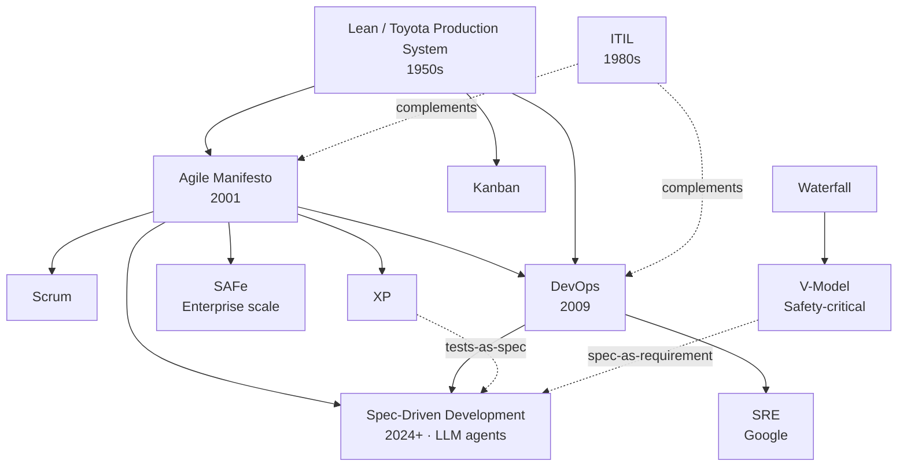

# Workflows contexts for devs

A personal reference of software engineering methodologies, frameworks, and operational practices — from the classical foundations (Lean, V-Model) to the agent-era practices reshaping how teams ship software (Spec-Driven Development).

Live site: [https://italosalgado14.github.io/methodology-cheatsheets/](https://italosalgado14.github.io/methodology-cheatsheets/)

## Contents

Roughly ordered from foundations → mainstream delivery → operations → safety-critical → enterprise scale → agent-era.

| File | Topic | Context |
|---|---|---|
| [`lean.md`](./lean.md) | Lean / Kaizen / VSM | Foundation behind Agile, Kanban, DevOps |
| [`agile.md`](./agile.md) | Agile / Scrum / Kanban | Iterative software delivery |
| [`devops.md`](./devops.md) | DevOps & CI/CD | Modern dev-to-ops integration |
| [`sre.md`](./sre.md) | Site Reliability Engineering | Reliability as engineering discipline |
| [`itil.md`](./itil.md) | ITIL 4 | IT service management (ServiceNow world) |
| [`v-model.md`](./v-model.md) | V-Model | Safety-critical embedded (automotive, medical, aerospace) |
| [`safe.md`](./safe.md) | SAFe | Agile at enterprise scale |
| [`sdd.md`](./sdd.md) | Spec-Driven Development | LLM / agent-era spec-first delivery (2024+) |
| [`List-Methodologies.md`](./List-Methodologies.md) | Catalog of all methodologies | Reference index by industry |

## How they relate

**Reading the map.** Lean is the root of most modern delivery thinking. Agile and DevOps sit at the center of mainstream software work. V-Model owns the regulated/safety-critical world. SDD is the newest layer: it inherits iterative cadence from Agile, the CI/eval loop from DevOps, executable intent from XP/BDD, and traceability from V-Model — but pushes code generation onto LLM agents.

## How to view diagrams

The diagrams use **Mermaid** syntax. They render automatically in:
- GitHub / GitLab
- Obsidian
- Notion
- VS Code (with Mermaid Preview extension)
- Typora
