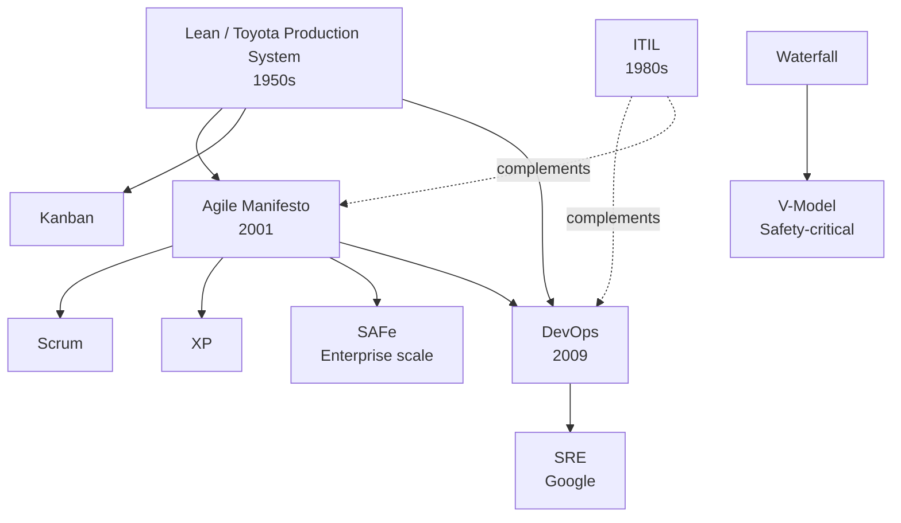

# Engineering Notes — Methodologies

A personal reference of software engineering methodologies, frameworks, and operational practices. Each file is self-contained and includes Mermaid diagrams.

## Contents

| File | Topic | Context |
|---|---|---|
| [`agile.md`](./agile.md) | Agile / Scrum / Kanban | Iterative software delivery |
| [`itil.md`](./itil.md) | ITIL 4 | IT service management (ServiceNow world) |
| [`devops.md`](./devops.md) | DevOps & CI/CD | Modern dev-to-ops integration |
| [`sre.md`](./sre.md) | Site Reliability Engineering | Reliability as engineering discipline |
| [`v-model.md`](./v-model.md) | V-Model | Safety-critical embedded (automotive, medical, aerospace) |
| [`safe.md`](./safe.md) | SAFe | Agile at enterprise scale |
| [`lean.md`](./lean.md) | Lean / Kaizen / VSM | Foundation behind Agile, Kanban, DevOps |
| [`List-Methodologies.md`](./List-Methodologies.md) | Catalog of all methodologies | Reference index by industry |

## How they relate

## How to view diagrams

The diagrams use **Mermaid** syntax. They render automatically in:
- GitHub / GitLab
- Obsidian
- Notion
- VS Code (with Mermaid Preview extension)
- Typora
