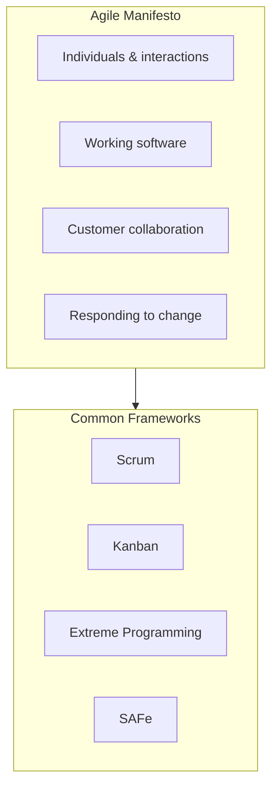
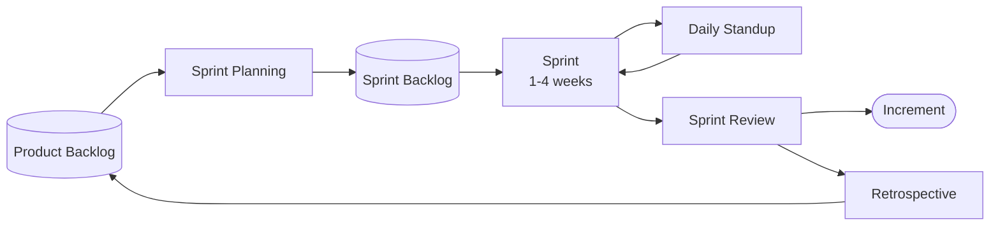
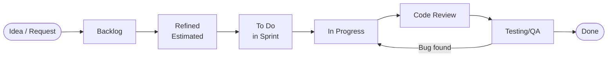
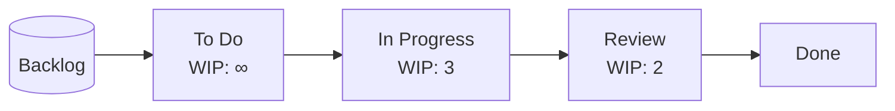
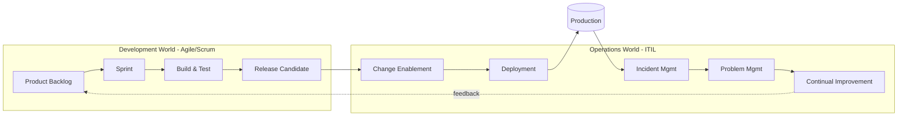

# Agile — Iterative Software Delivery

**Agile** is a philosophy for software development based on the **Agile Manifesto (2001)**, which prioritizes:

- **Individuals and interactions** over processes and tools
- **Working software** over comprehensive documentation
- **Customer collaboration** over contract negotiation
- **Responding to change** over following a plan

Agile is not a single methodology — it's an umbrella of frameworks (Scrum, Kanban, XP, SAFe, LeSS) that share iterative delivery, short feedback loops, and cross-functional teams.

---

## The 4 values and 12 principles

The Manifesto's 4 values are supported by 12 principles, including: deliver working software frequently, welcome changing requirements, build projects around motivated individuals, and reflect regularly on how to become more effective.

---

## Scrum framework (the most common Agile flavor)

Scrum organizes work into fixed-length **sprints** (usually 1–4 weeks), with defined roles, events, and artifacts.

### Roles
- **Product Owner** — owns the backlog, sets priorities, represents the customer
- **Scrum Master** — facilitates the process, removes blockers, coaches the team
- **Development Team** — cross-functional, self-organizing, builds the increment

### Events
- Sprint Planning, Daily Standup, Sprint Review, Retrospective

---

## User Story lifecycle (in Jira)

A user story moves through workflow states from creation to done.

---

## Kanban — the alternative to Scrum

Kanban abandons fixed sprints in favor of **continuous flow** with WIP (Work In Progress) limits. Work is pulled when capacity is available, not pushed on a schedule.

**When to choose which:**
- **Scrum** → predictable feature work, planned releases
- **Kanban** → unpredictable inflow (support, ops, maintenance)

---

## How Agile works together with ITIL

Agile and ITIL are **complementary**, not competing. Agile teams **build** software iteratively; ITIL teams **operate and support** it reliably. Modern organizations connect both worlds via DevOps practices.

**Key handoffs:**
- Sprint produces a release candidate → ITIL **Change Enablement** assesses and approves deployment
- Production incidents (ITIL) feed **Problem Management**, generating new backlog items for the Agile team
- The Agile **Retrospective** and ITIL **Continual Improvement** mirror each other — both are structured reflection loops
- SLAs from ITIL become **non-functional requirements** in the Agile backlog (performance, availability, recovery time)

---

## Quick reference

| Concept | One-line description |
|---|---|
| **Sprint** | Fixed-length iteration (1–4 weeks) producing a working increment |
| **Product Backlog** | Ordered list of everything that could be built |
| **User Story** | Small, valuable piece of functionality from a user's perspective |
| **Story Points** | Relative estimate of effort/complexity |
| **Velocity** | Average story points completed per sprint |
| **WIP Limit** | Max items allowed in a workflow column (Kanban) |
| **Definition of Done** | Shared checklist for what "done" means |
| **Retrospective** | Team meeting to inspect and adapt the process |
