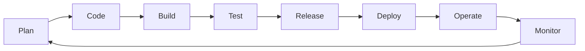
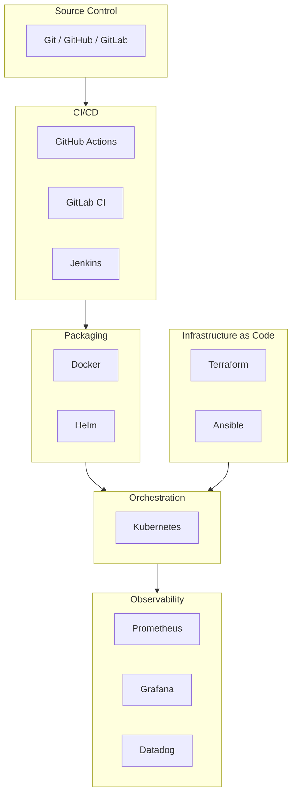

# DevOps — Unifying Development and Operations

**DevOps** is a cultural and technical movement that unifies software development (Dev) and IT operations (Ops) to deliver software faster, more reliably, and with shorter feedback loops. It emerged around 2009 from the Agile and Lean movements.

Core pillars: **CAMS** — Culture, Automation, Measurement, Sharing.

---

## The DevOps infinity loop

The classic representation: an endless cycle where development and operations feed each other.

---

## CI/CD pipeline

The technical backbone of DevOps: every commit flows automatically through build, test, and deploy.

---

## Tooling landscape

---

## DORA metrics — measuring DevOps performance

Industry-standard metrics from the DORA research:

| Metric | What it measures | Elite target |
|---|---|---|
| **Deployment Frequency** | How often you release | Multiple per day |
| **Lead Time for Changes** | Commit → production | < 1 hour |
| **Change Failure Rate** | % of deploys causing issues | 0–15% |
| **Mean Time to Restore (MTTR)** | Time to recover from failure | < 1 hour |

---

## When to adopt DevOps

- Cloud-native or web/SaaS products
- Multiple deployments per week (or more)
- Cross-functional teams that own services end-to-end
- Less suited (in pure form) to safety-critical embedded — though CI/CD principles still apply
