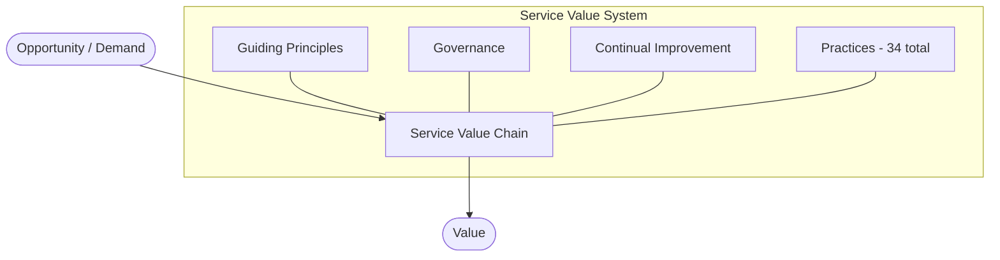
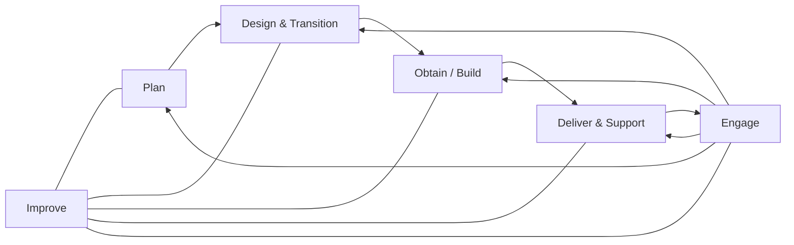
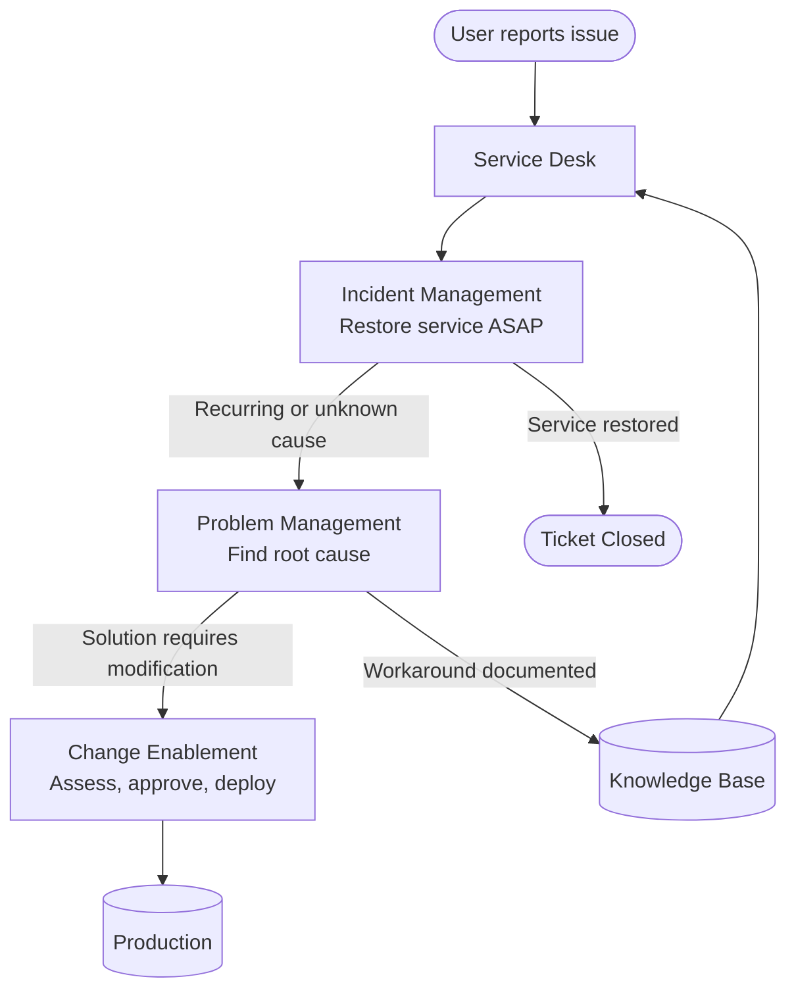
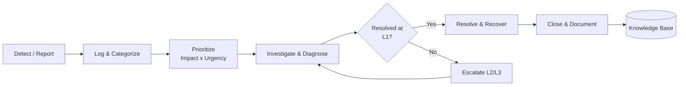
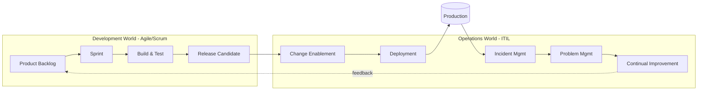
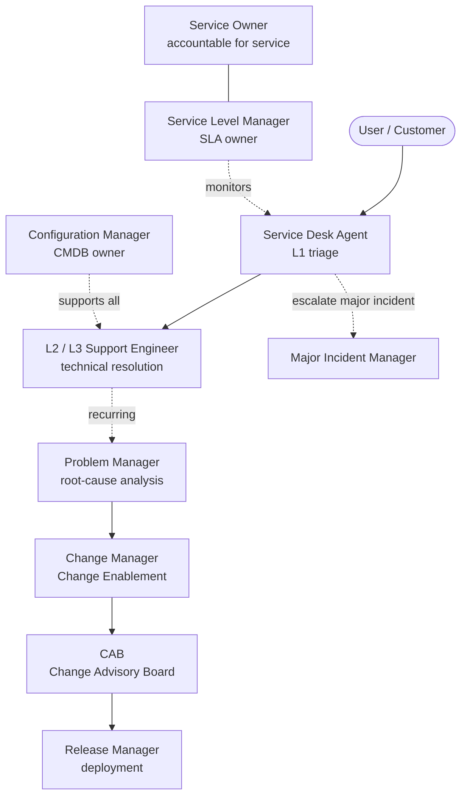

# ITIL 4 — IT Service Management Framework

**ITIL (Information Technology Infrastructure Library)** is a globally recognized framework of best practices for IT Service Management (ITSM). Originally created in the 1980s by the UK government and now owned by AXELOS/PeopleCert, the current version is **ITIL 4** (2019).

The core idea: IT should be managed as a set of **services delivered to customers**, not just as technology. ITIL provides common vocabulary and structured practices so organizations can deliver, support, and continuously improve those services.

---

## Core concept: the Service Value System (SVS)

Everything in ITIL 4 revolves around the SVS — a model that turns demand into value through a central engine called the Service Value Chain.

### The 7 Guiding Principles
1. Focus on value
2. Start where you are
3. Progress iteratively with feedback
4. Collaborate and promote visibility
5. Think and work holistically
6. Keep it simple and practical
7. Optimize and automate

---

## The Service Value Chain

Six interconnected activities. They are **not** sequential — different value streams combine them in different orders.

---

## Key practices: Incident vs Problem vs Change

The three practices you'll hear most often in any ServiceNow-based support team.

---

## Incident Management lifecycle

The standard flow a support ticket follows from detection to closure.

---

## How ITIL works together with Agile

ITIL doesn't compete with Agile — it complements it. Agile **builds** software iteratively; ITIL **operates and supports** it reliably over its full lifecycle. ITIL 4 explicitly embraces Agile, DevOps, and Lean.

**Key handoffs:**
- Agile team finishes a release → ITIL **Change Enablement** assesses risk and approves deployment
- Production incidents are managed under **Incident Management** with SLAs
- Recurring issues feed **Problem Management**, which generates new backlog items for the Agile team
- **Continual Improvement** closes the loop between operations and development

---

## Quick reference

| Concept | One-line description |
|---|---|
| **SVS** | Top-level model turning demand into value |
| **Service Value Chain** | Six activities: Plan, Improve, Engage, Design & Transition, Obtain/Build, Deliver & Support |
| **Incident** | Unplanned interruption — restore service fast |
| **Problem** | Underlying cause of one or more incidents |
| **Change** | Addition, modification, or removal of anything that could affect services |
| **SLA** | Service Level Agreement — measurable commitments to the customer |
| **CMDB** | Configuration Management Database — inventory of IT assets and relationships |

---

## Team roles

ITIL organizations have formalized roles around each practice. You will see these job titles (often in ServiceNow-based shops).

| Role | Primary responsibility |
|---|---|
| **Service Owner** | End-to-end accountability for a service across its lifecycle |
| **Service Desk Agent (L1)** | First contact, logs and triages incidents and requests |
| **L2 / L3 Support Engineer** | Technical investigation and resolution of escalated tickets |
| **Incident Manager** | Owns the Incident Management practice; coordinates response |
| **Major Incident Manager** | Leads high-severity incidents; drives comms and resolution |
| **Problem Manager** | Root-cause analysis for recurring or high-impact incidents |
| **Change Manager** | Assesses change risk, chairs the CAB, approves deployments |
| **Release Manager** | Plans and coordinates deployment of approved changes |
| **Configuration Manager** | Owns the CMDB; maintains CI accuracy and relationships |
| **Service Level Manager** | Negotiates and monitors SLAs, OLAs, and underpinning contracts |
| **Knowledge Manager** | Curates the knowledge base so fixes are reusable |
