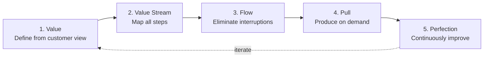
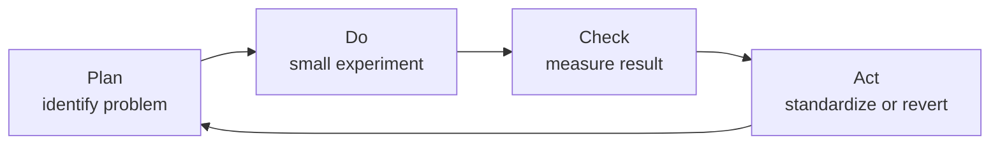
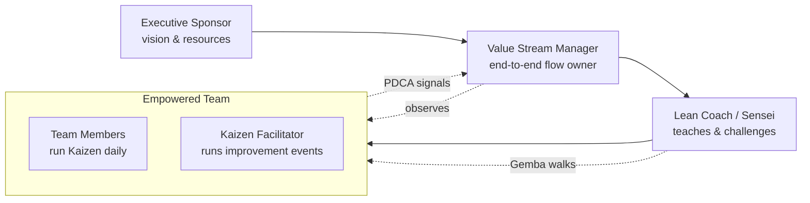

# Lean — Eliminating Waste, Maximizing Value

**Lean** originated at Toyota in the 1950s as the **Toyota Production System (TPS)**. It was later codified as "Lean Manufacturing" and adapted to software by Mary and Tom Poppendieck as **Lean Software Development** (2003).

Core idea: maximize customer value while minimizing waste. Lean is a mindset, not a process — it underpins Agile, Kanban, DevOps, and SRE.

---

## The 5 principles of Lean (Womack & Jones)

---

## The 7 wastes (Muda)

Originally from manufacturing, adapted to software:

| Manufacturing waste | Software equivalent |
|---|---|
| **Overproduction** | Building features nobody uses |
| **Waiting** | Blocked tasks, slow approvals, slow CI |
| **Transport** | Handoffs between teams |
| **Over-processing** | Gold-plating, unnecessary documentation |
| **Inventory** | Unfinished work, large backlogs, big batches |
| **Motion** | Context switching, tool-hopping |
| **Defects** | Bugs, rework |

An 8th is sometimes added: **Unused talent / creativity**.

---

## Value Stream Mapping

A core Lean technique: visualize every step from customer request to delivery, separating **value-adding** from **non-value-adding** time.

```mermaid
flowchart LR
    Req([Customer request]) --> Wait1[Wait: 3 days]
    Wait1 --> Design[Design: 2 days ✓]
    Design --> Wait2[Wait approval: 5 days]
    Wait2 --> Dev[Develop: 4 days ✓]
    Dev --> Wait3[Wait QA: 2 days]
    Wait3 --> Test[Test: 1 day ✓]
    Test --> Wait4[Wait deploy: 3 days]
    Wait4 --> Deploy[Deploy: 1 day ✓]
    Deploy --> Done([Delivered])
```

Lead time: 21 days. Value-add time: 8 days. **Process efficiency: 38%** — the gap is the opportunity.

---

## Kaizen — continuous improvement

Small, incremental improvements made constantly by everyone, not occasional big initiatives.

This is the **PDCA cycle** (Plan-Do-Check-Act / Deming Cycle), the engine of Kaizen.

---

## Lean tools and concepts

| Concept | Meaning |
|---|---|
| **Kanban board** | Visual workflow management (came from Toyota) |
| **JIT (Just In Time)** | Produce only what's needed, when needed |
| **Jidoka** | Build quality in; stop the line on defect |
| **Andon** | Visual signal that something needs attention |
| **Gemba** | "The real place" — go see the work being done |
| **Poka-Yoke** | Mistake-proofing — make errors impossible |
| **5S** | Sort, Set in order, Shine, Standardize, Sustain |
| **Heijunka** | Level the workload, avoid spikes |

---

## Tooling

Lean is more philosophy than tooling, but common supporting tools:

| Purpose | Tools |
|---|---|
| **Value stream mapping** | Miro, Lucidchart, Mural, pen and paper |
| **Kanban boards** | Jira, Trello, LeanKit, Azure Boards |
| **Flow metrics** | ActionableAgile, Jira (with plugins), Plandek |
| **Process docs** | Confluence, Notion |

---

## Lean in different contexts

- **Lean Manufacturing** — original Toyota application
- **Lean Software Development** — Poppendieck's adaptation
- **Lean Startup** — Eric Ries: Build–Measure–Learn with MVPs
- **Lean Six Sigma** — Lean + statistical quality control
- **Lean Portfolio Management** — applied to investment / portfolio decisions (used in SAFe)

---

## Why Lean still matters

Almost every modern methodology has Lean roots:
- **Kanban** is Lean visualization applied to knowledge work
- **Agile** shares Lean's focus on small batches and feedback
- **DevOps** is Lean applied to the dev-to-ops value stream
- **SRE's** toil reduction is Lean waste elimination

Understanding Lean gives you the conceptual foundation behind all of them.

---

## Team roles

Lean deliberately avoids heavy role definitions — its premise is that *everyone* owns improvement. Still, these roles appear in Lean transformations (software and manufacturing alike).

| Role | Primary responsibility |
|---|---|
| **Executive Sponsor** | Provides vision, resources, and removes organizational blockers |
| **Value Stream Manager** | End-to-end accountability for one value stream; owns flow metrics |
| **Lean Coach / Sensei** | Teaches Lean thinking; challenges teams via Gemba walks and questions |
| **Kaizen Facilitator** | Runs improvement events (Kaizen blitz), trains PDCA |
| **Team Members** | Empowered to stop the line, suggest and run small experiments |
| **Gemba Leader (manager)** | Goes to "the real place" to observe, not to command |
| **Change Agent** | Drives cultural adoption across departments during a transformation |

In software contexts, these roles **overlap with Agile / DevOps roles** (Product Manager, Engineer, Engineering Manager) rather than replacing them. Lean is a lens, not a separate team.
