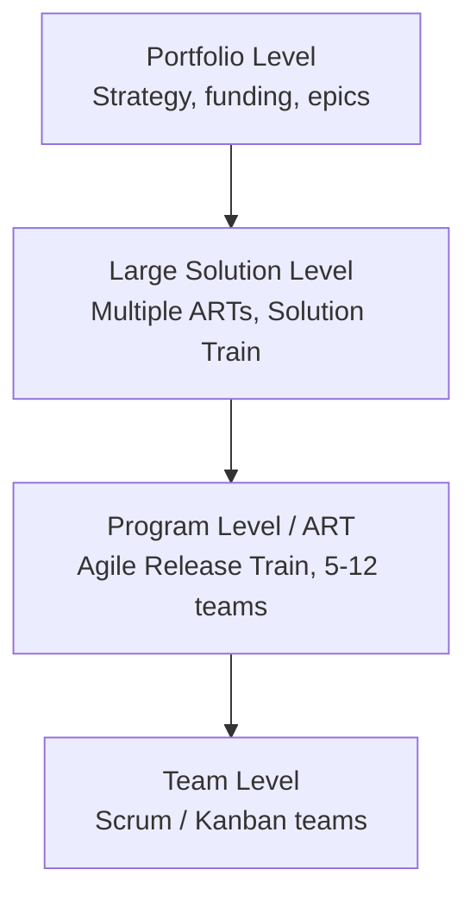
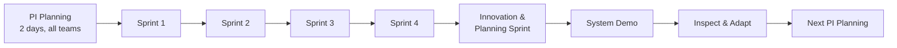
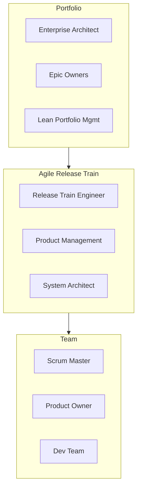

# SAFe — Scaled Agile Framework

**SAFe (Scaled Agile Framework)** is the most widely adopted framework for applying Agile at enterprise scale — coordinating dozens or hundreds of Agile teams working on the same product or portfolio. Created by Dean Leffingwell, current version is **SAFe 6.0**.

It combines Agile, Lean, and DevOps principles into a structured model with four configurations: **Essential, Large Solution, Portfolio, and Full SAFe**.

---

## The four levels

---

## The Agile Release Train (ART)

The ART is SAFe's core unit: 5–12 Agile teams (50–125 people) working together on a common cadence to deliver value.

A **Program Increment (PI)** typically lasts 8–12 weeks (4–5 sprints + 1 IP sprint).

---

## Key roles

---

## Key events

| Event | Cadence | Purpose |
|---|---|---|
| **PI Planning** | Every 8–12 weeks | Whole ART aligns on objectives for next PI |
| **Sprint** | 2 weeks | Standard Scrum sprint |
| **System Demo** | End of each sprint | Integrated demo across teams |
| **Scrum of Scrums** | Weekly | Cross-team coordination |
| **PO Sync** | Weekly | Product owners align on priorities |
| **Inspect & Adapt (I&A)** | End of PI | Retrospective + problem-solving for the entire ART |

---

## Tooling

| Purpose | Tools |
|---|---|
| **Enterprise Agile planning** | Jira Align, Azure DevOps, Targetprocess, Planview |
| **Team-level** | Jira, Azure Boards |
| **Roadmapping** | Aha!, ProductPlan |
| **PI Planning (remote)** | Miro, Mural, Easy Agile Programs |
| **Reporting** | Jira Align dashboards, Power BI |

---

## Criticisms and when NOT to use SAFe

SAFe is controversial in the Agile community. Common criticisms:
- Too prescriptive and bureaucratic
- Reintroduces hierarchy that Agile tried to remove
- Heavy upfront planning (PI Planning) can feel like mini-waterfall

**Don't use SAFe if:** you have fewer than ~50 people, or you can succeed with simpler frameworks like **LeSS** (Large-Scale Scrum) or **Spotify Model**.

**Do use SAFe if:** you're in a large enterprise (>500 people), regulated industry, or need to coordinate dependencies across many teams with predictable releases.

---

## SAFe vs alternatives

| Framework | Size | Style |
|---|---|---|
| **Scrum** | 1 team | Lightweight |
| **LeSS** | 2–8 teams | Minimalist scaling |
| **Nexus** | 3–9 teams | Scrum.org's scaling |
| **SAFe** | 50–1000s | Prescriptive, structured |
| **Spotify Model** | Any | Cultural, not a framework |
