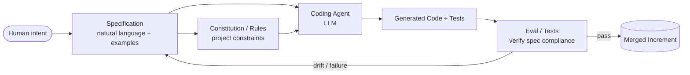
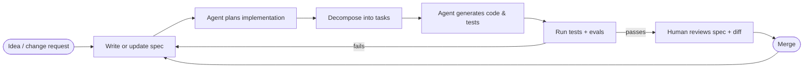
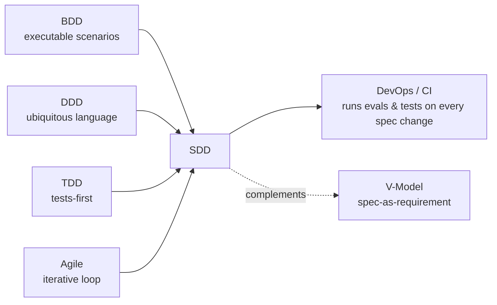
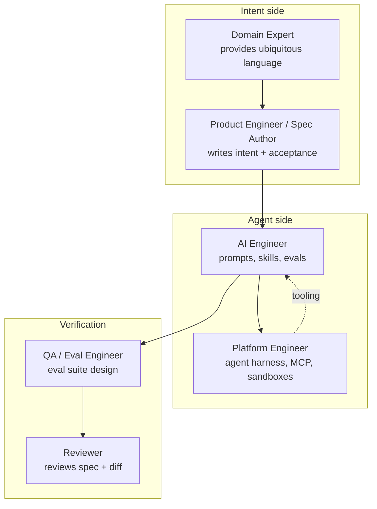

# Spec-Driven Development (SDD) — Specs as the source of truth in the agent era

**Spec-Driven Development (SDD)** is a methodology where a written **specification of intent** — not the code — is the primary, durable artifact. Code is treated as a derivative that LLM-based coding agents generate, refactor, and regenerate from the spec.

It became practical around **2024–2026** as large language models gained long context, tool use, and the ability to follow project-level rules. Reference implementations include **GitHub Spec Kit**, **AWS Kiro**, **Anthropic Claude Code (skills + sub-agents)**, **Cursor / Windsurf rules**, and **Tessl**.

> SDD is *stricter* than "vibe coding" (where the prompt is the only artifact) but *less ceremonial* than the V-Model. It is **intent-driven**, not necessarily business-driven — the spec can describe business outcomes, technical contracts, or both.

---

## Core idea



The spec — not the code — is what gets reviewed in PRs, debated in design, and versioned over years. Code becomes a **build artifact** of the spec.

---

## SDD vs predecessors

| Approach | Source of truth | Generated by | Verified by |
|---|---|---|---|
| **Waterfall / V-Model** | Requirements document | Humans | Manual tests + traceability |
| **TDD** | Failing tests | Humans | Tests pass |
| **BDD** | Gherkin scenarios | Humans | Cucumber / equivalents |
| **DDD** | Ubiquitous language + domain model | Humans | Domain experts |
| **Vibe coding** | The prompt | LLM | Whatever the dev eyeballed |
| **SDD** | Versioned natural-language **spec + rules** | LLM agent | Tests + LLM-as-judge + human review of the spec |

SDD borrows traceability from V-Model, executable intent from BDD, and ubiquitous language from DDD — then pushes generation onto the agent.

---

## The SDD cycle



In the GitHub Spec Kit flow this maps to `/specify` → `/plan` → `/tasks` → implementation. AWS Kiro splits it as **Specs** (per-feature) + **Steering** (project-wide rules).

---

## The four artifacts of an SDD repo

| Artifact | Purpose | Example |
|---|---|---|
| **Constitution / steering rules** | Project-wide constraints the agent must respect | "Use Postgres, never ORMs"; "All services emit OpenTelemetry"; coding standards |
| **Spec** | Intent for one feature: what, why, acceptance criteria | "Users can revoke API tokens; revoked tokens fail within 60s" |
| **Plan** | Agent-proposed implementation outline | Files to touch, contracts, migration steps |
| **Generated code + tests** | The build output | The actual diff, regenerable from the spec |

---

## When SDD shines

- **Greenfield / AI-native teams** — no legacy fighting the agent
- **Microservice or modular codebases** — clear boundaries make regeneration safe
- **Internal tools, scripts, prototypes** — speed wins, spec doubles as docs
- **Repeated patterns** (CRUD, integrations, glue code) — agent does the rote work

## When to be careful

- **Safety-critical / regulated** — V-Model traceability and regulator-accepted evidence still rule (ISO 26262, IEC 62304, DO-178C). LLM-generated artifacts are not yet a recognized form of qualified evidence.
- **Legacy codebases** — agent context windows and code idiosyncrasies fight regeneration
- **Tacit knowledge–heavy systems** — if the "why" lives in heads, the spec will be incomplete and the agent will hallucinate around the gaps

---

## How SDD relates to other methodologies



- **Inside Agile**: SDD replaces "translate user story → code." The story *is* the spec, refined into acceptance criteria the agent implements against.
- **With DevOps / CI**: each spec change triggers regeneration + eval suite + tests in CI.
- **With V-Model**: the spec naturally provides traceability, but regulator acceptance of LLM-generated artifacts is still maturing.

---

## Tooling landscape (2025–2026)

| Category | Tools |
|---|---|
| **Spec frameworks** | GitHub Spec Kit, AWS Kiro, Tessl, Cursor / Windsurf rules |
| **Coding agents** | Claude Code, Cursor, Windsurf, Aider, OpenAI Codex CLI, Devin |
| **Evals / LLM-as-judge** | Braintrust, LangSmith, Promptfoo, Anthropic evals |
| **Skills / sub-agents** | Claude Code skills, Cursor `.cursor/rules`, custom MCP servers |
| **Spec storage** | Markdown in repo (`/specs`, `.specify/`, `.kiro/`) |
| **Verification** | Standard test runners + agent-driven test generation |

---

## Quick reference

| Concept | One-line description |
|---|---|
| **Spec** | Natural-language statement of intent + acceptance criteria, versioned in the repo |
| **Constitution / steering** | Project-level rules the agent always honors |
| **Plan** | Agent's proposed implementation, reviewable before code is generated |
| **Skill / rule** | Reusable instruction set the agent loads when relevant |
| **Eval** | Automated check that generated output matches spec intent |
| **LLM-as-judge** | Use of an LLM to score outputs against spec acceptance criteria |
| **Regeneration** | Re-running the agent against an updated spec to refresh the code |
| **Drift** | Code diverging from spec — the SDD bug to chase |

---

## Team roles

SDD reorganizes the team around the **spec** and the **agent harness** rather than around the code itself.



| Role | Primary responsibility |
|---|---|
| **Product Engineer / Spec Author** | Translates user/business intent into a written, testable spec |
| **Domain Expert** | Owns the ubiquitous language and edge cases — keeps the spec honest |
| **AI Engineer** | Designs prompts, skills/sub-agents, retrieval, and evals |
| **Platform Engineer** | Maintains the agent harness, MCP servers, sandboxes, CI integration |
| **Reviewer** | Reviews the **spec change** first, then the generated diff for surprises |
| **QA / Eval Engineer** | Builds the eval suite — automated + LLM-as-judge — that gates merges |

---

## A minimal SDD repo layout

```
.
├── .specify/                # or .kiro/, .specs/
│   ├── constitution.md      # project-wide rules
│   ├── features/
│   │   ├── 001-token-revoke.md
│   │   └── 002-billing-export.md
│   └── plans/
│       └── 001-token-revoke.plan.md
├── src/                     # generated and maintained code
├── tests/                   # generated + hand-written
└── evals/                   # spec-vs-output evaluations
```

The spec directory is the **first thing reviewed** in any change — code follows.
