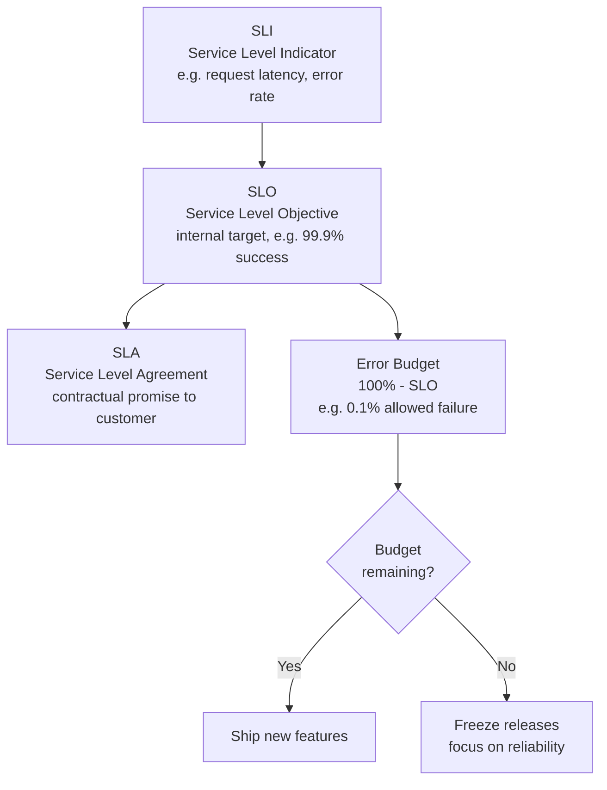
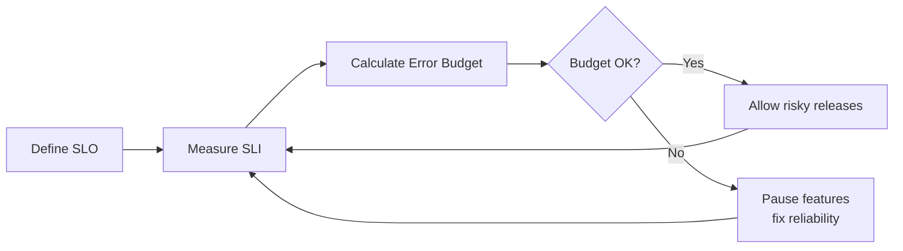
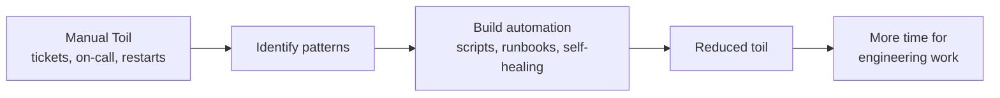
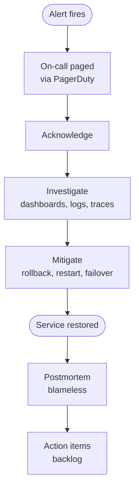

# SRE — Site Reliability Engineering

**Site Reliability Engineering** is Google's engineering approach to operations: "what happens when you ask a software engineer to design an operations team." Codified in the *Google SRE Book* (2016), it treats operations as a software problem.

Key idea: reliability is a **feature** that must be measured, budgeted, and traded off against new development.

---

## Core concepts: SLI, SLO, SLA, Error Budget

---

## The error budget loop

The mechanism that balances velocity vs reliability.

---

## Toil and automation

**Toil** = manual, repetitive operational work. SREs aim to cap toil at < 50% of their time and automate the rest.

---

## On-call and incident response

---

## Tooling

| Category | Tools |
|---|---|
| **Metrics** | Prometheus, Datadog, New Relic, CloudWatch |
| **Dashboards** | Grafana, Datadog |
| **Logs** | Loki, ELK stack, Splunk, Datadog Logs |
| **Tracing** | Jaeger, Tempo, Honeycomb, OpenTelemetry |
| **Alerting / On-call** | PagerDuty, Opsgenie, VictorOps |
| **Incident mgmt** | incident.io, FireHydrant, Rootly |
| **Chaos engineering** | Chaos Monkey, Gremlin, LitmusChaos |

---

## SRE vs DevOps vs ITIL

| Aspect | DevOps | SRE | ITIL |
|---|---|---|---|
| Origin | Community movement | Google engineering | UK government / ITSM |
| Focus | Culture + automation | Reliability as engineering | Service management |
| Key metric | DORA metrics | SLO / Error Budget | SLA compliance |
| Best for | Modern web/cloud teams | High-scale, high-reliability services | Enterprise IT operations |

> "SRE is a concrete implementation of DevOps principles."
