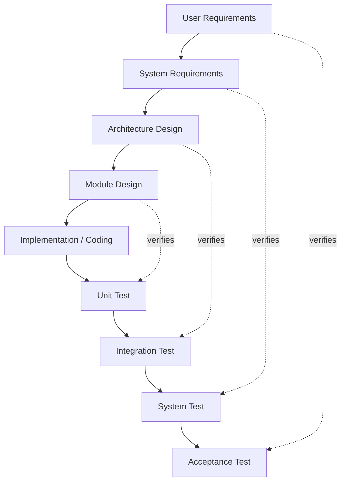
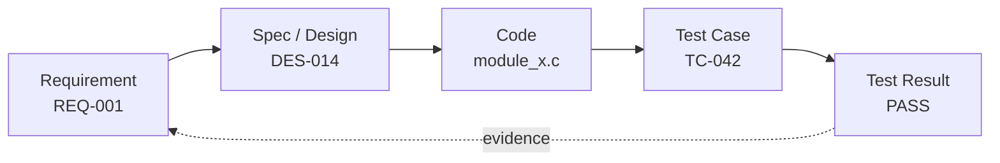
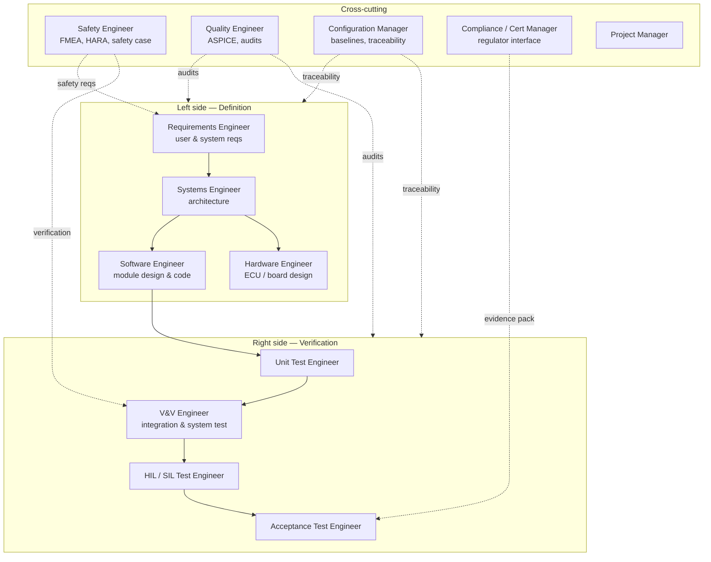

# V-Model — Verification & Validation for Safety-Critical Systems

The **V-Model** is a development methodology where each design phase has a corresponding test phase, forming a "V" shape. It is the dominant model in **safety-critical embedded systems**: automotive (ISO 26262), medical devices (IEC 62304), aerospace (DO-178C), railway (EN 50128), and industrial (IEC 61508).

Core principle: **every requirement must be traceable to a test**, and every test must verify a defined requirement.

---

## The V-Model diagram

The left side decomposes the system; the right side integrates and verifies it. Horizontal arrows show the verification relationship.

---

## Traceability — the heart of the V-Model

Every artifact must trace forward to tests and backward to requirements. This is what regulators audit.

---

## Industry standards by domain

| Domain | Standard | Safety levels |
|---|---|---|
| Automotive | **ISO 26262** | ASIL A → D |
| Automotive process | **ASPICE** | Level 0 → 5 |
| Medical devices | **IEC 62304** | Class A → C |
| Aerospace | **DO-178C** | DAL E → A |
| Railway | **EN 50128** | SIL 0 → 4 |
| Industrial | **IEC 61508** | SIL 1 → 4 |
| Functional safety (general) | **IEC 61508** | SIL 1 → 4 |

---

## Tooling

| Purpose | Tools |
|---|---|
| **Requirements management** | IBM DOORS, Polarion, Jama Connect, codeBeamer |
| **Modeling** | MATLAB/Simulink, Stateflow, Enterprise Architect, Cameo |
| **Static analysis** | Polyspace, LDRA, Coverity, SonarQube |
| **Unit testing (C/C++)** | VectorCAST, Cantata, Tessy, Google Test |
| **HIL/SIL testing** | dSPACE, Vector CANoe, NI VeriStand |
| **Coverage** | LDRA, VectorCAST, Bullseye |
| **Configuration mgmt** | Git + strict branching, IBM Rational Synergy |

---

## V-Model vs Agile

They seem opposed but increasingly coexist:

| Aspect | V-Model | Agile |
|---|---|---|
| Approach | Sequential, document-heavy | Iterative, working software |
| Strength | Traceability, audit, safety | Speed, adaptability |
| Best for | Embedded, regulated industries | Web, SaaS, internal tools |
| Risk | Late discovery of issues | Hard to certify |

**Hybrid: Agile-V / SafeScrum** — Iterations within the V, with each sprint producing traceable artifacts. Common in modern automotive (Tesla, OEMs adopting ASPICE + Agile).

---

## When you'll encounter it

Given your embedded background: any role in **automotive, medical imaging, robotics with safety functions, industrial automation, aerospace, or defense** will use some form of the V-Model. Even when teams say "we do Agile," the underlying compliance work follows V-Model traceability.

---

## Team roles

V-Model teams include roles dedicated to requirements, safety, and verification — roles you rarely see in pure web/SaaS Agile teams. Roles map naturally to the left (definition) and right (verification) sides of the V.

| Role | Primary responsibility |
|---|---|
| **Requirements Engineer** | Elicits, writes, and maintains user and system requirements in DOORS/Polarion |
| **Systems Engineer** | Architecture and decomposition across HW/SW |
| **Software Engineer / Firmware Engineer** | Module design, coding (often MISRA C/C++), static analysis |
| **Hardware Engineer** | ECU, PCB, sensor/actuator integration |
| **Safety Engineer** | Hazard analysis (HARA/FMEA), derives safety requirements, writes safety case |
| **Quality Engineer (SQA)** | Process audits, ASPICE/CMMI compliance, defect metrics |
| **V&V Engineer** | Verification and validation strategy, integration and system test |
| **Unit Test Engineer** | Structural coverage (MC/DC) with VectorCAST, Cantata, Tessy |
| **HIL / SIL Test Engineer** | Hardware/Software-in-the-Loop test benches (dSPACE, CANoe) |
| **Configuration Manager** | Baselines, change control, end-to-end traceability matrices |
| **Compliance / Certification Manager** | Interface with regulators (FDA, TÜV, EASA) and cert evidence |
| **Project Manager** | Plans phases, manages milestones and reviews |
